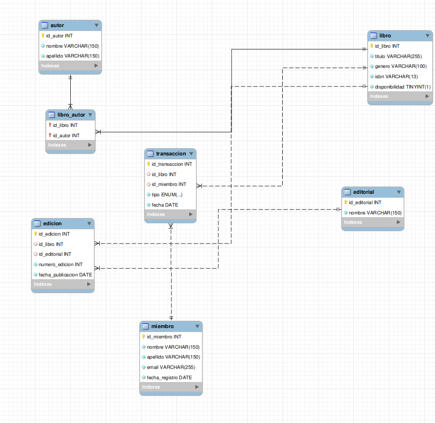
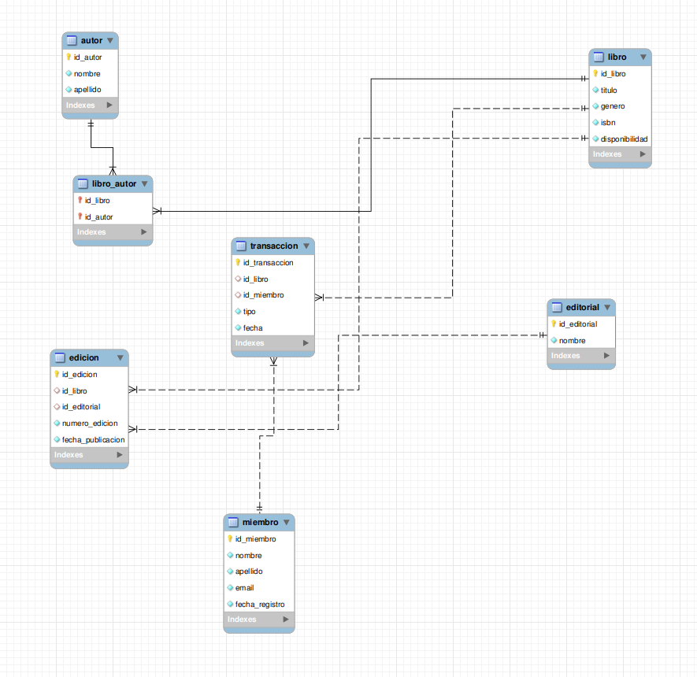

# Proyecto Biblioteca Campus

Este proyecto consiste en el diseño e implementación de un sistema de gestión de base de datos para la Biblioteca Campus. Permite administrar la información de libros, autores, editoriales, ediciones, miembros y el registro de las transacciones de préstamos y devoluciones.

## Estructura del Proyecto

El proyecto está organizado bajo la siguiente estructura de archivos:

biblioteca_campus/
├── README.md
└── storage/
    ├── mysql/
    │   ├── db.sql
    │   └── insert.sql
    └── diagrams/
        ├── diagrama_logico.png
        ├── diagrama_fisico.png
        └── ERM.png

## Diagramas
### Diagrama Fisico

### Diagrama Logico

## Consultas SQL del Sistema

A continuación se presentan las consultas requeridas para la gestión y análisis de los datos de la biblioteca:

### Listar todos los libros disponibles
SELECT * FROM libro WHERE disponibilidad = TRUE;

### Buscar libros por género
SELECT * FROM libro WHERE genero = 'Novela';

### Obtener información de un libro por ISBN
SELECT * FROM libro WHERE isbn = '9780307474728';

### Contar el número de libros en la biblioteca
SELECT COUNT(*) AS total_libros FROM libro;

### Listar todos los autores
SELECT * FROM autor;

### Buscar autores por nombre
SELECT * FROM autor WHERE nombre LIKE '%Gabriel%';

### Obtener todos los libros de un autor específico
SELECT l.* FROM libro l 
JOIN libro_autor la ON l.id_libro = la.id_libro 
WHERE la.id_autor = 1;

### Listar todas las ediciones de un libro
SELECT * FROM edicion WHERE id_libro = 1;

### Obtener la última edición de un libro
SELECT * FROM edicion WHERE id_libro = 1 ORDER BY numero_edicion DESC LIMIT 1;

### Contar cuántas ediciones hay de un libro específico
SELECT COUNT(*) AS total_ediciones FROM edicion WHERE id_libro = 1;

### Listar todas las transacciones de préstamo
SELECT * FROM transaccion WHERE tipo = 'prestamo';

### Obtener los libros prestados actualmente
SELECT * FROM libro WHERE disponibilidad = FALSE;

### Contar el número de transacciones de un miembro específico
SELECT COUNT(*) AS total_transacciones FROM transaccion WHERE id_miembro = 1;

### Listar todos los miembros de la biblioteca
SELECT * FROM miembro;

### Buscar un miembro por nombre
SELECT * FROM miembro WHERE nombre LIKE '%Carlos%' OR apellido LIKE '%Carlos%';

### Obtener las transacciones de un miembro específico
SELECT * FROM transaccion WHERE id_miembro = 1;

### Listar todos los libros y sus autores
SELECT l.titulo, a.nombre, a.apellido 
FROM libro l
JOIN libro_autor la ON l.id_libro = la.id_libro
JOIN autor a ON la.id_autor = a.id_autor;

### Obtener el historial de préstamos de un libro específico
SELECT t.*, m.nombre, m.apellido 
FROM transaccion t
JOIN miembro m ON t.id_miembro = m.id_miembro
WHERE t.id_libro = 1 AND t.tipo = 'prestamo';

### Contar cuántos libros han sido prestados en total
SELECT COUNT(*) AS total_prestamos FROM transaccion WHERE tipo = 'prestamo';

### Listar todos los libros junto con su última edición y estado de disponibilidad
SELECT l.titulo, l.disponibilidad, e.numero_edicion, e.fecha_publicacion
FROM libro l
LEFT JOIN (
    SELECT id_libro, numero_edicion, fecha_publicacion
    FROM edicion e1
    WHERE numero_edicion = (SELECT MAX(numero_edicion) FROM edicion e2 WHERE e2.id_libro = e1.id_libro)
) e ON l.id_libro = e.id_libro;
